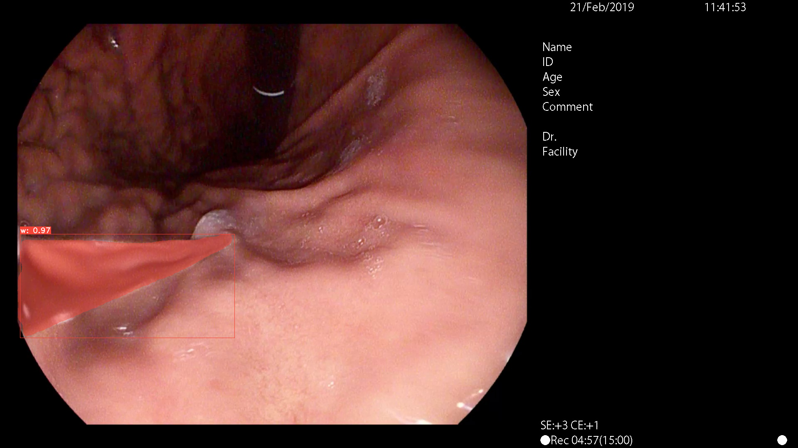

## YOLACT++训练自己的数据集

## **Y**ou **O**nly **L**ook **A**t **C**oefficien**T**s

paper:

[YOLACT: Real-time Instance Segmentation](https://arxiv.org/abs/1904.02689)
[YOLACT++: Better Real-time Instance Segmentation](https://arxiv.org/abs/1912.06218)


**Xu Jing**

### 1.将labelme标注的数据转化为coco数据样式

通过[labelme](https://github.com/wkentaro/labelme)我们标注了自己的训练集，我们将标注的训练集经过如下处理后即可得到coco样式的数据

```
$ cd labelme-master/examples/instance_segmentation
$ python3 labelme2coco.py water water_coco --labels labels.txt
```

其中`labels.txt`文件为labelme标注的label名称列表，如下：

```
__ignore__
_background_
water

```

会在当前文件夹下的`water_coco`文件下生成`JPEGImages`文件夹内存放了所有的image及`annotations.json`为coco类型的标注文件。


### 2. YOLACT环境安装

+ clone yolact项目

```
$ git clone https://github.com/dbolya/yolact.git
$ cd yolact
```

+ 安装相关环境


```
# anaconda
$ conda env create -f environment.yml

```

```
# Pytorch 1.0.1 (or higher) 和 TorchVision建议手动安装

# Cython needs to be installed before pycocotools
$ pip3 install cython
$ pip3 install opencv-python pillow pycocotools matplotlib 

```

如果想使用YOLACT++,请编译DCNv2

```
$ cd external/DCNv2
$ python3 setup.py build develop
```

### 3.修改yolact代码

+ 打开`yolact-master/data/config.py`

```
# 修改dataset_base

# ----------------------- DATASETS ----------------------- #

dataset_base = Config({
    'name': 'water',   # 起个名字

    # Training images and annotations
    'train_images': './myData/coco/JPEGImages/train',  # 训练集的路径
    'train_info':   './myData/coco/annotations/train/annotations_train.json', # 标签的路径

    # Validation images and annotations.
    'valid_images': './myData/coco/JPEGImages/val', # 验证集路径
    'valid_info':   './myData/coco/annotations/train/annotations_val.json', #验证集标签的路径

    # Whether or not to load GT. If this is False, eval.py quantitative evaluation won't work.
    'has_gt': True,

    # A list of names for each of you classes.
    'class_names': ('water'),   # 修改成自己的class name 是一个truple

    # COCO class ids aren't sequential, so this is a bandage fix. If your ids aren't sequential,
    # provide a map from category_id -> index in class_names + 1 (the +1 is there because it's 1-indexed).
    # If not specified, this just assumes category ids start at 1 and increase sequentially.
    'label_map': {1:1}   # 修改成自己的label map
})
```


+ 修改数据名称和`num_classes`。（`num_classes=数据集标签类数+1`）


```

# ----------------------- YOLACT v1.0 CONFIGS ----------------------- #

yolact_base_config = coco_base_config.copy({
    'name': 'yolact_base',

    # Dataset stuff
    'dataset': dataset_base,   # 数据源
    'num_classes': 1 + 1,   # 类别数量 = label + 1

    # Image Size
    'max_size': 550,
    
    # Training params
    'lr_steps': (280000, 600000, 700000, 750000),
    'max_iter': 800000,
```


### 4.训练


+ 下载预训练权重放至根目录里的`weights`文件夹下
   
  - For Resnet101, download resnet101_reducedfc.pth from [here](https://drive.google.com/file/d/1tvqFPd4bJtakOlmn-uIA492g2qurRChj/view?usp=sharing).
  - For Resnet50, download resnet50-19c8e357.pth from [here](https://drive.google.com/file/d/1Jy3yCdbatgXa5YYIdTCRrSV0S9V5g1rn/view?usp=sharing).
  - For Darknet53, download darknet53.pth from [here](https://drive.google.com/file/d/17Y431j4sagFpSReuPNoFcj9h7azDTZFf/view?usp=sharing).

+ 在训练过程中按`ctrl+c`能够保存当前训练权重并保存在weight文件夹里。命名为：`<config>_<epoch>_<iter>.pth`

+ 训练

使用默认为8的batch size训练：

```
$ python3 train.py --config=yolact_base_config
```

根据根据实际情况可以适当调节batch size的大小，如果显卡性能低可以减小batch size大小：

```
$ python3 train.py --config=yolact_base_config --batch_size=5

```
从中断的权重继续训练：

```
$ python3 train.py --config=yolact_base_config --resume=weights/yolact_base_10_32100.pth --start_iter=-1
```

```
$ python3 train.py --config=yolact_plus_resnet50_config
```

帮助：

```
$ python3 train.py --help
```

### 5.推断

+ image

```
# Display qualitative results on the specified image.
$ python3 eval.py --trained_model=weights/yolact_base_54_800000.pth --score_threshold=0.15 --top_k=15 --image=my_image.png

# Process an image and save it to another file.
$ python3 eval.py --trained_model=weights/yolact_base_54_800000.pth --score_threshold=0.15 --top_k=15 --image=input_image.png:output_image.png

# Process a whole folder of images.
$ python3 eval.py --trained_model=weights/yolact_base_54_800000.pth --score_threshold=0.15 --top_k=15 --images=path/to/input/folder:path/to/output/folder


$ python3 eval.py --trained_model=weights/yolact_plus_resnet50_1086_100000.pth --score_threshold=0.15 --top_k=15 --images=./test:./result

```

+ video

```
# Display a video in real-time. "--video_multiframe" will process that many frames at once for improved performance.
# If you want, use "--display_fps" to draw the FPS directly on the frame.
$ python3 eval.py --trained_model=weights/yolact_base_54_800000.pth --score_threshold=0.15 --top_k=15 --video_multiframe=4 --video=my_video.mp4

# Display a webcam feed in real-time. If you have multiple webcams pass the index of the webcam you want instead of 0.
$ python3 eval.py --trained_model=weights/yolact_base_54_800000.pth --score_threshold=0.15 --top_k=15 --video_multiframe=4 --video=0

# Process a video and save it to another file. This uses the same pipeline as the ones above now, so it's fast!
$ python3 eval.py --trained_model=weights/yolact_base_54_800000.pth --score_threshold=0.15 --top_k=15 --video_multiframe=4 --video=input_video.mp4:output_video.mp4

$ python3 eval.py --trained_model=weights/yolact_plus_resnet50_1086_100000.pth --score_threshold=0.50 --top_k=15 --video_multiframe=4 --display_fps --video=test.mp4:test_res.mp4

python3 eval.py --trained_model=weights/yolact_plus_resnet50_1086_100000.pth --score_threshold=0.50 --top_k=15 --display_fps --video=test.mp4:test_res.mp4


```

+ help

```
python3 eval.py --help

```



### 6.Referecne


```
@inproceedings{yolact-iccv2019,
  author    = {Daniel Bolya and Chong Zhou and Fanyi Xiao and Yong Jae Lee},
  title     = {YOLACT: {Real-time} Instance Segmentation},
  booktitle = {ICCV},
  year      = {2019},
}
```

For YOLACT++, please cite
```
@misc{yolact-plus-arxiv2019,
  title         = {YOLACT++: Better Real-time Instance Segmentation},
  author        = {Daniel Bolya and Chong Zhou and Fanyi Xiao and Yong Jae Lee},
  year          = {2019},
  eprint        = {1912.06218},
  archivePrefix = {arXiv},
  primaryClass  = {cs.CV}
}
```